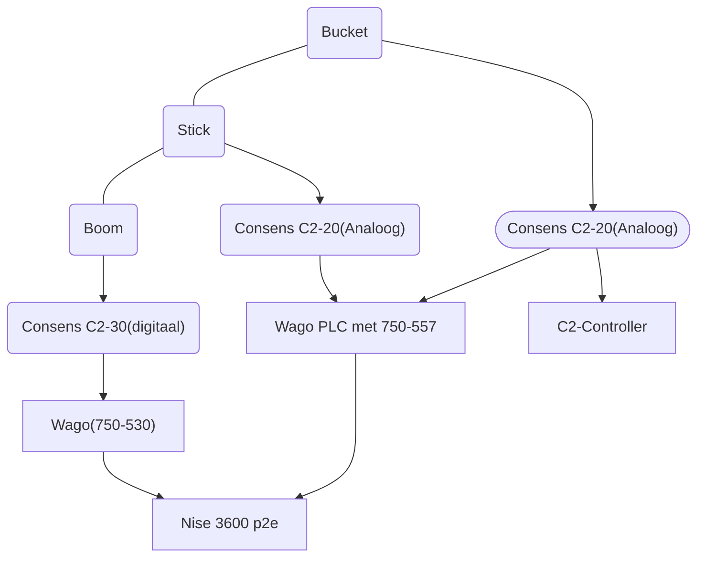

```mermaid
flowchart TB
    A("Bucket ")
    B("Stick ")
    C("Boom ")
    D(["Consens C2-20(Analoog)"])
    E("Consens C2-30(digitaal)")
    F["Wago PLC met 750-557"]
    G("Consens C2-20(Analoog)")
    H["Wago(750-530)"]
    I["Nise 3600 p2e"]
    J["C2-Controller "]
    A --- B
    B --- C
    A --> D
    C --> E
    D --> F
    B --> G
    G --> F
    E --> H
    F --> I
    H --> I
    D --> J
    %% mermaid-flow:pos A=113,46 B=365,42 C=637,46 D=164,167 E=651,169 F=257,277 G=427,169 H=551,284 I=404,414 J=34,284
```

